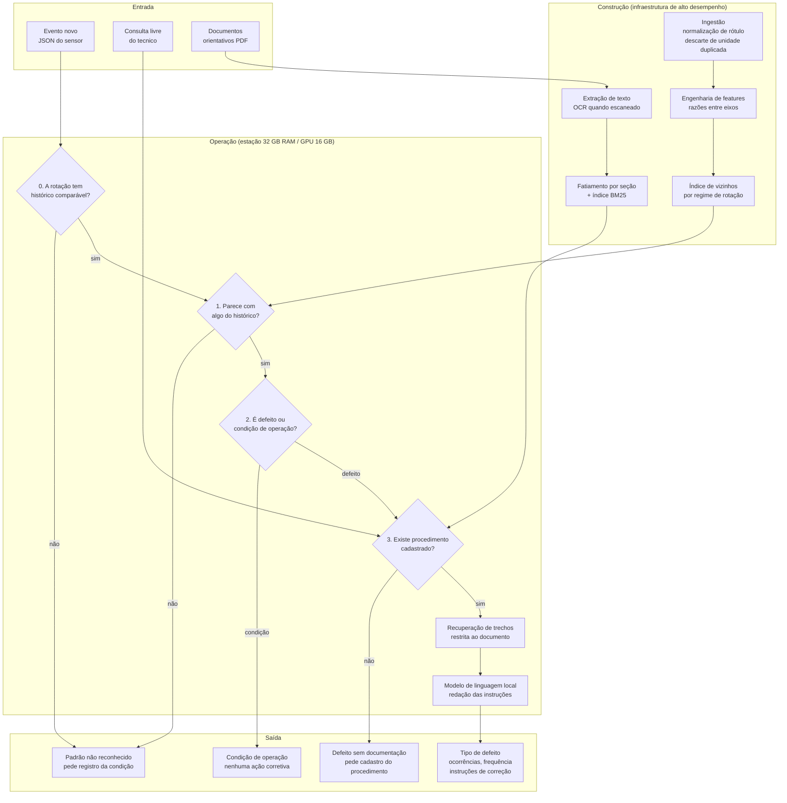
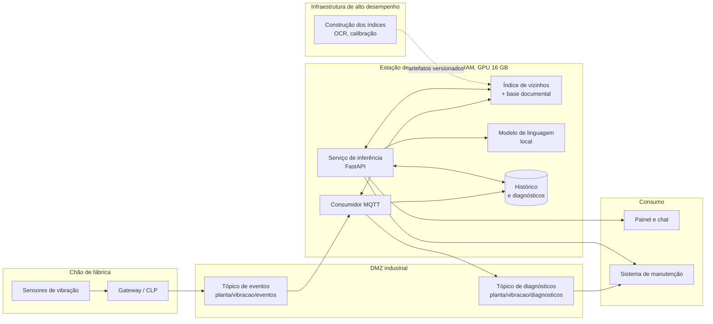

# Arquitetura da Solução

## 1. O problema, reformulado

O enunciado pede manutenção prescritiva com uma restrição que define todo o
desenho: a solução **não deve depender da classificação prévia de falhas
conhecidas**. Deve identificar padrões semelhantes dentro do histórico e
recuperar o conhecimento que ensina a corrigir.

Isso descarta a solução óbvia. Um classificador supervisionado treinado com
`fault` como alvo aprende um conjunto fechado de classes e, diante de um defeito
novo, devolve com confiança a classe conhecida menos errada. É exatamente o
comportamento que o enunciado proíbe.

O desenho adotado inverte a ordem: **o histórico é o modelo**. Um evento novo é
comparado ao passado, os vizinhos encontrados trazem seus próprios rótulos, e o
diagnóstico é o consenso deles. Um defeito nunca visto não tem vizinho próximo,
aparece como distância alta e é recusado em vez de rotulado.

## 2. Visão geral



Os portões são sequenciais e cada um encerra o atendimento. O modelo de
linguagem só é acionado depois que todos passaram, e mesmo ali ele **não decide
o defeito**: recebe o defeito já determinado e o texto do procedimento, e sua
única tarefa é redigir.

As duas formas de interação da Figura 01 do enunciado — diagnóstico e chat —
convergem no mesmo portão 3. O chat não passa pelos portões 0 a 2 porque não há
evento de sensor numa pergunta, mas passa pelo de cobertura, com mecanismo
próprio descrito na §3.9. Sem isso a solução recusaria prescrever para um defeito
sem procedimento numa aba e prescreveria para o mesmo defeito na aba ao lado.

## 3. Decisões e o porquê

### 3.1 Similaridade em vez de classificação

`sklearn.neighbors.NearestNeighbors` sobre features padronizadas com
`RobustScaler`. Nenhum rótulo entra como alvo de treino. O rótulo dos vizinhos é
lido no momento da consulta, o que dá três propriedades que um classificador não
tem:

- **rastreabilidade** — cada diagnóstico vem com os eventos históricos que o
  sustentam, com id e data. O técnico pode auditar;
- **atualização sem retreino** — indexar um evento novo é acrescentar uma linha;
- **conjunto aberto** — um padrão sem vizinho próximo é recusado.

A busca é por força bruta, e é a escolha certa aqui: em 20 dimensões as árvores
de particionamento degradam e ficam mais lentas que a varredura.

### 3.2 Partição por regime de rotação, com tolerância declarada

A vibração escala com a rotação. Comparar um evento de 500 rpm com o histórico de
2000 rpm não diz nada. Existe um índice por regime — 0, 500, 1000 e 2000 rpm, as
quatro rotações do ensaio, verificado em `scripts/eda.py` —, e a busca só encontra
vizinhos comparáveis. Manter índices separados é mais barato e mais correto do que
um índice único com o rpm como feature: evita que a distância seja dominada pela
rotação e garante que todo vizinho retornado seja comparável.

Uma rotação fora dessa grade cai no regime conhecido mais próximo **apenas dentro
de uma tolerância** de 10% do valor do regime, com piso absoluto de 25 rpm. A
parte relativa acompanha a escala do regime; o piso existe porque 10% de 0 rpm
seria tolerância zero, e também mantém rotação negativa fora de qualquer regime.
Fora da tolerância o evento recebe `padrao_desconhecido` com motivo explícito
("a rotação de X rpm não tem histórico comparável").

O encaixe sem limite parece robusto e é o oposto disso. Pela regra anterior, que
só tomava o valor mais próximo, um evento a 12000 rpm caía no regime de 2000 rpm e
recebia diagnóstico completo contra um histórico que não lhe dizia respeito — e
`-50` rpm caía em `0rpm`. Nada na resposta denunciava o encaixe: `regime_rpm`
sozinho não diz que a rotação medida era outra.

Por isso o `Diagnostico` carrega hoje dois campos que antes só existiam como
legenda de tela: `rpm`, a rotação bruta, e `regime_aproximado`, o sinalizador de
que a comparação usou um regime vizinho. Quem consome pela API, pela fila MQTT ou
pelo CMMS recebe o aviso junto com o diagnóstico, e não só quem está olhando a
tela. A mudança no contrato da API é aditiva — nenhum campo saiu.

### 3.3 Descarte de colunas redundantes

Cinco pares de colunas medem a mesma grandeza em unidades diferentes
(polegada/milímetro nas quatro de velocidade, Fahrenheit/Celsius na temperatura).
A correlação medida fica entre 0,999997 e 0,999999, e a razão nos quatro pares de
velocidade é 25,41. A temperatura correlaciona igual sem razão constante, porque a
conversão é afim e não uma multiplicação — o que confirma a redundância em vez de
contradizê-la. Manter os dois lados dá peso duplo à mesma medida na distância: as
colunas imperiais são descartadas e o Sistema Internacional fica como canônico.

### 3.4 Rejeição calibrada: dois portões, e qual deles faz o trabalho

**Portão de distância.** O limiar é o percentil 99 da distância média entre um
evento e seus vizinhos, medido dentro do próprio histórico, separadamente por
regime. Um evento mais distante do histórico do que 99% dos eventos históricos
estão entre si não se parece com nada já visto.

**Portão de consenso.** Se o rótulo mais votado não aparece em pelo menos 45% dos
vizinhos, eles estão divididos e o diagnóstico é recusado.

O portão de consenso mede **voto simples** — um voto por vizinho —, e não o peso.
A distinção não é detalhe. O peso é o inverso da distância, e com um vizinho quase
idêntico ele domina a soma: medido no índice de produção sob o critério anterior,
**62,3% das consultas tinham um único vizinho carregando mais da metade do peso, e
a mediana desse peso era 0,99997**. Nesse regime o kNN vira 1-NN, e o portão
deixava de disparar justamente quando os vizinhos mais discordavam: um único
ponto próximo levava a soma acima de 45% sozinho, por mais dividida que a
vizinhança estivesse.

Duas mudanças consertam isso, e são independentes: o peso ganhou piso relativo à
escala da própria vizinhança (5% da distância mediana), e o portão passou a rodar
sobre a fração simples. Nos mesmos 300 eventos, o peso do maior vizinho caiu para
mediana **0,051** contra 0,040 do peso uniforme entre 25 vizinhos — quase plano — e
**nenhuma** consulta tem um vizinho acima de metade do peso. O efeito no portão é
grande: ao sortear do histórico, a rejeição passa de 16,3% para 42,3% nos mesmos
eventos. Essa correção e a da §3.5 entraram juntas e foram medidas juntas — os 26
pontos são o efeito somado das duas, e separá-las exigiria uma terceira medição
que esta entrega não fez.

As duas medidas continuam publicadas, porque medem coisas diferentes: `confianca`
é a fração do peso que o rótulo vencedor reúne e diz **o quanto o vencedor está
perto**; `consenso_simples` e `votos` dizem **quantos concordam**. É a segunda que
sustenta a palavra "consenso". `scripts/demo.py` imprime as duas lado a lado, na
forma crua que um técnico consegue interpretar — "22 de 25 vizinhos (88%) | peso
88%". **O painel Streamlit ainda não faz isso**: ele exibe só a fração de peso, sob
um rótulo que promete consenso. É dívida conhecida desta entrega, anotada aqui em
vez de omitida.

**Qual dos dois portões faz o trabalho.** Medido na partição temporal, em 399
eventos: 125 rejeitados, sendo **6 pela distância e 119 pelo consenso**. O portão
de consenso responde por 95,2% das rejeições — ele é o mecanismo principal, e o
percentil de distância é o secundário. Isso importa porque a propriedade que
define o projeto (conjunto aberto, taxa de rejeição como alarme de deriva)
repousa quase toda sobre o `min_consensus: 0.45`, e esse valor **não tem
varredura de sensibilidade** em lugar nenhum do repositório. É a lacuna
metodológica declarada em `RESULTADOS.md` §6.

### 3.5 Exclusão da vizinhança temporal, não só do próprio id

O projeto rejeita a partição aleatória porque leituras gravadas a segundos de
distância caem dos dois lados. A mesma objeção se aplica à demonstração: quando o
evento consultado vem do próprio histórico — que é o modo padrão da aba
Diagnóstico —, o índice de produção contém as leituras vizinhas do mesmo bloco de
gravação.

Excluir apenas o id do evento não resolve. O ensaio gravou uma leitura a cada dois
segundos, e a leitura seguinte é praticamente a mesma medição com outro carimbo de
hora: ela entra como vizinho a distância ~0 e o resultado parece bom por um motivo
que não existe em produção. Por isso a consulta aceita `momento` e `janela_s`, e o
motor usa 300 s — cerca de 150 leituras, duas ordens de grandeza acima do
espaçamento. Quando o corte leva vizinhos demais, a busca é ampliada (`k` cresce)
em vez de devolver um consenso apurado sobre meia dúzia de sobreviventes.

Um evento novo de verdade não tem gêmeo no passado, então a janela não muda nada
para ele. Ela existe para que a demonstração rode contra o mesmo sistema que foi
medido: medir com um critério e demonstrar com outro seria repetir, na tela, o
vazamento que o repositório inteiro condena no papel.

O efeito está medido em 300 eventos sorteados do histórico. Sob o critério
anterior — só o próprio id fora da busca, e o peso sem piso — a taxa de rejeição é
de **16,3%**; com a janela de 300 s e o peso da §3.4, **42,3%**, a mesma ordem de
grandeza dos 33,5% da partição temporal. As duas correções foram medidas juntas; a
tabela completa, com a distribuição de peso dos dois lados, está em
[`RESULTADOS.md`](RESULTADOS.md) §1.

O painel fica com um número pior e honesto, que é o único que sobrevive à pergunta
"contra qual índice a busca roda quando eu clico em sortear?".

### 3.6 Cobertura documental decidida pelo escopo, não pelo corpo

O enunciado exige que a solução se detenha aos problemas que possuem documentos.
A associação defeito → documento **não está escrita no código**: é descoberta em
tempo de execução comparando o defeito com o **escopo** de cada documento —
título e objetivo —, nunca com o corpo inteiro.

A razão é que **título declara o que o documento trata; corpo apenas menciona**.
Um procedimento de rolamentos cita acoplamento, polia e correia entre as causas e
os sintomas, e decidir por presença no corpo faria a falha desses componentes
parecer atendida por um procedimento que não os trata.

**Sobre o tamanho do efeito neste acervo, sem inflar:** rodando a mesma regra
sobre o corpo, o mapa dos onze defeitos sai **idêntico**. Os seis procedimentos
são monotemáticos e nomeiam o componente no título, então não existe caso, aqui,
em que as duas regras discordem. A escolha pelo escopo não corrige um erro
observado — ela protege a propriedade que precisa continuar valendo quando o
acervo crescer, que é exatamente o que o cadastro de documento novo permite. Um
manual genérico, ou um procedimento longo que discuta vários componentes,
quebraria a regra do corpo e não quebra a do escopo.

Vale registrar por que esta seção mudou: a versão anterior justificava a escolha
dizendo que o procedimento de rolamentos cita "Ventiladores" e que por isso uma
falha de ventoinha receberia o Doc1. **Essa justificativa era falsa** — o radical
de "ventoinha" e o de "ventilador" são diferentes, como `tests/test_text.py`
verifica explicitamente, e o casamento nunca aconteceria. O argumento correto é o
de cima, e é mais fraco em efeito medido e mais forte em razão.

A regra tem duas partes: o **termo-chave** é exigência — todos os seus radicais
precisam estar no escopo, senão o documento nem disputa — e os **termos de
contexto** desempatam entre procedimentos que citam o mesmo componente. Casar no
título vale o dobro de casar no objetivo, porque o título diz do que o
procedimento *trata* enquanto o objetivo pode apenas mencionar.

Como a descoberta é dinâmica, um documento novo enviado pelo usuário passa a dar
cobertura sem alteração de código. É o outro lado da recusa: quando o sistema diz
"não há procedimento para este defeito", o caminho para resolver é cadastrar o
documento, e o efeito é imediato. `POST /documentos` invalida o cache de extração
do nome reenviado antes de reindexar — sem isso, corrigir um PDF devolveria o
texto antigo e o sistema seguiria prescrevendo pela versão errada, que é o oposto
do que o endpoint existe para resolver.

### 3.7 Radical por plural mais truncamento

A busca casa radicais, não palavras. São dois passos porque um só não resolve: o
truncamento sozinho separaria "polia" de "polias" (5 e 6 letras) e o documento de
polias deixaria de cobrir a falha de polia; a regra de plural sozinha não uniria
"desalinhado" com "desalinhamento", que é derivação.

O corte em 6 caracteres é o que separa "correia" de "correcao" — as duas só
divergem na sexta letra, e cortar antes faria a falha de correia casar com os
seis procedimentos, já que todos têm "Correção" no título.

A normalização remove acento dos dois lados da busca. O procedimento de
rolamentos chega por OCR e perde acentuação; sem isso, "correcao" não encontraria
"correção".

### 3.8 Modelo de linguagem local e plugável

O motor de diagnóstico não conhece nenhum modelo: conhece uma interface. Há dois
adaptadores.

O **Ollama** roda um modelo local. Local por exigência do enunciado — a
inferência precisa caber numa estação comercial — e porque o dado de chão de
fábrica não sai da planta.

O **gerador determinístico** monta a resposta recortando os trechos recuperados,
sem modelo. Existe por dois motivos. Operacional: se o serviço do modelo cair, a
planta continua recebendo instrução correta. Técnico: é a linha de base contra a
qual o modelo precisa provar que vale a pena, e como só reproduz texto já
aprovado pela engenharia, **não tem como alucinar**.

A troca acontece em **dois momentos**, e os dois são necessários. Na construção
do motor, se o Ollama não responder, o determinístico assume. E a cada chamada:
a geração é envolvida em `try/except`, e uma falha do serviço cai para o recorte
no mesmo pedido, marcando `gerador="deterministico (fallback em execucao)"` na
resposta. Só o primeiro degrau não bastava — o motor é singleton de processo, a
disponibilidade era avaliada uma vez no boot, e um Ollama que caísse às 3h
derrubava com `500` um diagnóstico que já estava pronto: defeito identificado,
histórico consultado, cobertura resolvida, trechos recuperados. A marcação existe
para que a degradação seja visível ao técnico em vez de silenciosa.

Medido com `scripts/comparar_modelos.py` numa máquina **sem GPU utilizável**
(i5-3330 de 2012, 16 GB, GPU AMD que o Ollama não acelera — inferência inteira em
CPU): `qwen2.5:3b` entregou uma prescrição completa em **11,7 s e 13,3 s** em duas
medições consecutivas, a cerca de 12 palavras/s para 141 e 167 palavras. A
primeira chamada depois de o serviço subir é bem mais lenta, porque carrega o
modelo do disco — é por isso que o `timeout_s` do `settings.yaml` é folgado, e é
por isso que um número medido a frio não descreve o regime de operação. É lento
para o gosto de quem está acostumado a serviço em nuvem e perfeitamente utilizável
para manutenção industrial, onde o evento chega e a ordem de serviço sai depois.
Na estação-alvo do enunciado, com GPU de 16 GB, o mesmo código roda um modelo de
7B a 14B com folga e latência bem menor — trocando uma variável de ambiente, sem
tocar em código (`docs/DEPLOY.md` §6).

O teto de tokens (`num_predict`) existe por causa desse regime: sem GPU cada
token custa tempo real, e uma resposta que divaga vira minutos de espera para o
técnico. Limitar o tamanho é limitar a latência.

### 3.9 Contenção de alucinação, nos dois caminhos

Quatro camadas, da mais forte para a mais fraca:

1. **O modelo não diagnostica.** O tipo de defeito vem da similaridade, que é
   determinística e auditável. O modelo recebe o defeito pronto.
2. **O modelo não fala sem documento.** Se não há procedimento cadastrado, o
   fluxo termina antes de chegar nele.
3. **O contexto é restrito ao documento que cobre aquele defeito**, não à base
   inteira.
4. **A instrução proíbe** acrescentar etapa, ferramenta, tolerância ou valor que
   não esteja no texto, e manda declarar a lacuna quando ela existir.

Toda resposta vem com os trechos que a originaram, para conferência.

**As camadas 2 e 3 valem também no chat**, e é aí que está a parte não óbvia. A
consulta livre não tem diagnóstico e por isso não tem defeito a partir do qual
resolver a cobertura. A regra que resolve isso cabe numa frase:

> **O catálogo decide SE o chat responde e quais procedimentos são candidatos; a
> aderência do texto só escolhe entre candidatos — nunca cria um.**

Daí saem as saídas que não chamam o modelo:

- **defeito nomeado sem procedimento.** Mesma recusa do diagnóstico, com pedido de
  cadastro. É a dupla obrigação que o enunciado escreve com todas as letras:
  reportar que o problema ainda não existe **e** sugerir registrar um documento.
- **nenhum defeito nomeado.** Não há o que ancorar. A recusa lista os defeitos que
  hoje têm procedimento, derivada da cobertura em tempo real — cadastrar um
  documento novo muda a resposta sozinho.
- **fenômeno que pertence a mais de um defeito.** "Excentricidade" é do rotor, que
  não tem procedimento, ou da polia, que tem — o Doc5 dedica a ela a seção 3.1.
  Citar o fenômeno sem dizer o componente deixa a pergunta indecidível, e a
  indecisão vira pergunta de volta ao técnico em vez de palpite.
- **restrição incompatível.** O combo "Restringir a um procedimento" da tela pode
  **estreitar** o que o catálogo aprovou; nunca criar aprovação.

O chat também usa uma instrução própria. A do diagnóstico manda o modelo não
rediscutir um defeito que "já foi determinado pela análise de similaridade" — numa
consulta livre não existe diagnóstico nenhum, e a frase convidava o modelo a
assumir um defeito que ninguém determinou.

### Por que não é um limiar de aderência

Até 2026-08-05 este portão tinha um piso de BM25 (`PISO_SCORE_CHAT = 2.5`) e uma
exigência de documento único, aplicados só quando a pergunta não nomeava defeito.
Uma auditoria adversarial de 101 perguntas mediu que **aquele ramo não decidia
nada**: as distribuições de score de pergunta legítima e de paráfrase de defeito
sem procedimento se sobrepõem inteiras.

| | ataque | controle |
|---|---|---|
| aderência do melhor trecho (mediana) | 6,88 | 7,83 |
| margem para o segundo documento (mediana) | 1,72 | 1,62 |
| razão entre primeiro e segundo (mediana) | 1,33 | 1,34 |

Não existe faixa vazia entre os dois grupos, e a varredura de limiar troca
vazamento por mudez quase de um para um. O piso antigo era pior do que inútil:
`"como balancear o rotor desbalanceado?"` pontua **2,01 dentro do próprio Doc3**,
abaixo dele — um piso que emudeceria um caso de teste do próprio projeto.

A causa está visível no acervo. O Doc5 tem a seção **"3.1 Excentricidade"**, que
abre com *"ocorre quando o centro geométrico da polia não coincide com o centro de
rotação"*. Uma pergunta sobre excentricidade do **rotor** — defeito que nenhum
procedimento cobre — casa com esse trecho quase palavra por palavra. O corpo não
distingue o defeito coberto do defeito homônimo em outro componente. Só o escopo
distingue, e quem consulta o escopo é o catálogo.

Por isso o piso foi **removido**, e não recalibrado: substituir um número ruim por
um número melhor manteria o erro de método.

Sem esse portão, perguntar "como corrigir rotor excêntrico?" devolvia trechos do
Doc6 (rotor inclinado) e o modelo escrevia passos de correção para o defeito que o
próprio sistema classifica como sem procedimento cadastrado — a solução recusando
prescrever numa aba e prescrevendo na outra, na mesma sessão.
`tests/test_motor_chat.py` e `tests/test_auditoria_portao.py` fixam o
comportamento; `scripts/auditoria_chat.py` refaz a medição e
`scripts/ablacao_portao.py` mostra quanto cada regra contribui.

**A camada 4 é a mais fraca, e a lista está nessa ordem de propósito.** Ela é uma
instrução em linguagem natural, não uma garantia, e a medição mostra isso.
Rodando `python scripts/comparar_modelos.py qwen2.5:3b` duas vezes sobre o mesmo
caso de desalinhamento, uma saída ficou colada nos trechos e a outra acrescentou
dois instrumentos — "calibrador de eixo" e "régua ou placa de referência" — que
não aparecem em nenhum dos quatro trechos recuperados do Doc2. Nenhuma das duas
inventou defeito, documento ou etapa fora do escopo daquele procedimento, porque
as camadas 1 a 3 são determinísticas e não dependem do modelo; a que falhou foi
justamente a que depende dele.

É essa medição, e não uma preferência de estilo, que sustenta o gerador
determinístico como algo mais que plano B. Ele recorta o texto aprovado pela
engenharia e não tem como acrescentar ferramenta nenhuma. Onde o custo de mandar
um técnico buscar o instrumento errado for alto, é ele que deve rodar — e a troca
é uma variável de ambiente, porque o motor conhece a interface e não o modelo.

## 4. Implantação em ambiente industrial



O empacotamento em container, as variáveis de ambiente e as limitações
conhecidas dessa configuração estão em [`DEPLOY.md`](DEPLOY.md).

**Separação entre construção e operação.** O enunciado permite treinar em
infraestrutura de alto desempenho e exige que a operação caiba numa estação
comercial. A separação é literal: OCR, fatiamento, construção do índice e
calibração dos limiares rodam offline e produzem artefatos versionados
(`indice_similaridade.joblib`, `base_conhecimento.json`). A estação apenas
carrega. Nenhum treino acontece em produção.

**Orçamento da estação.** O índice serializado dos 144 mil eventos ocupa **9,7 MB**
em disco e a base documental, **71 KB** — os dois cabem em memória sem discussão.
Medido com `docker stats` após um diagnóstico completo ([`DEPLOY.md`](DEPLOY.md)
§6), a API ocupa 254 MiB e o painel 52 MiB: cerca de 306 MB para a stack inteira.
O modelo de linguagem é o item dominante por larga margem — um modelo de 7B a 14B
em quantização de 4 bits ocupa 5–9 GB de VRAM, dentro dos 16 GB. Ou seja, dos
32 GB de RAM da estação, praticamente toda a folga deve ser reservada ao Ollama, e
não aos containers. O item pesado no disco é o histórico: o SQLite tem 44 MB.

**Duas portas de entrada, uma regra de decisão.** A API HTTP atende quem
pergunta; o sensor não pergunta, ele publica. O consumidor MQTT
(`src/prescritiva/integracao/mqtt.py`) assina o tópico de eventos e chama o
**mesmo** `MotorDiagnostico` — não existe uma segunda regra de decisão. Três
detalhes só aparecem quando isso roda de verdade: o diagnóstico roda numa thread
separada da rede (fazê-lo no callback do paho estoura o keepalive e o broker
reentrega a mensagem, o que já produziu um evento diagnosticado duas vezes com
duas prescrições diferentes); a mensagem só é confirmada ao broker depois de
publicada, para que uma queda no meio faça reentrega em vez de perda; e mensagem
malformada vai para um tópico de erros próprio, porque "não entendi a mensagem" e
"não reconheci o padrão" são coisas diferentes para quem integra.

**O ciclo fecha no banco.** Todo diagnóstico emitido, seja por HTTP ou por fila, é
gravado na tabela `diagnosticos` do mesmo SQLite de onde o histórico é lido. A
gravação fica fora do motor de propósito: decidir o defeito não pode depender de
disco disponível, e uma falha de gravação não pode reter a resposta que o técnico
está esperando — ela vira um `registro_id` nulo e explícito, não um erro. A tabela
é um log *append-only*, sem chave única por evento: o mesmo evento pode ser
rediagnosticado depois que um procedimento novo é cadastrado, e sobrescrever
apagaria a trilha que justifica a decisão tomada naquele momento.

**Ciclo de vida.** Novos eventos rotulados alimentam a reconstrução periódica do
índice. Novos procedimentos entram pelo próprio painel ou por `POST /documentos`.

**Monitoramento de deriva.** A taxa de rejeição é o alarme, e
`GET /diagnosticos` a expõe como contagem por situação. Ela é uma medida direta de
quanto os eventos que chegam se parecem com o histórico; quando sobe de forma
sustentada, ou a máquina mudou de condição ou a instrumentação foi recalibrada, e
o índice precisa ser reconstruído. A avaliação por campanha
([`RESULTADOS.md`](RESULTADOS.md) §2) mostra o fenômeno acontecendo dentro do
próprio conjunto de dados fornecido — a rejeição sobe de 33,5% para 42,5% —, o que
torna esse monitoramento uma necessidade demonstrada, não uma precaução teórica.

## 5. Organização do código

```
src/prescritiva/
├── config.py            configuracao, catalogo e sobrescritas por ambiente
├── text.py              normalizacao, radical, tokenizacao
├── data/
│   ├── schema.py        contrato do evento, pares de unidade duplicada
│   └── ingest.py        CSV -> parquet + SQLite, rotulo, campanha, regime de rpm
├── features/build.py    matriz de features, usada na indexacao e na consulta
├── similarity/index.py  indice de vizinhos, consenso, rejeicao, janela temporal
├── knowledge/
│   ├── extract.py       PDF -> texto, OCR com cache
│   ├── chunk.py         fatiamento por secao
│   └── store.py         busca de trecho e regra de cobertura
├── llm/
│   ├── base.py          interface do gerador
│   ├── ollama_client.py adaptador do modelo local
│   ├── deterministico.py recorte dos trechos, sem modelo
│   └── factory.py       selecao no boot
├── evaluation/splits.py particoes aleatoria, temporal e por campanha
├── diagnosis/
│   ├── historico.py     estatisticas de ocorrencia via SQL
│   ├── contexto.py      leitura do regime do evento contra o historico do padrao
│   └── engine.py        orquestracao dos portoes, diagnostico e chat
├── integracao/
│   ├── mqtt.py          consumidor da fila do chao de fabrica
│   └── repositorio.py   persistencia dos diagnosticos emitidos
└── api/main.py          endpoints HTTP
```

`features/build.py` é a peça que amarra o sistema: a mesma função constrói as
features das 144 mil linhas na indexação e as do evento único na consulta. Não
existe caminho separado onde as duas possam divergir.

`diagnosis/contexto.py` fica fora do motor pelo motivo oposto: ele não decide
nada. Nenhum dos quatro desfechos muda em função da leitura de contexto
operacional — ela explica o diagnóstico já tomado, e por isso a tela e quem
consome a API leem exatamente o mesmo texto.
