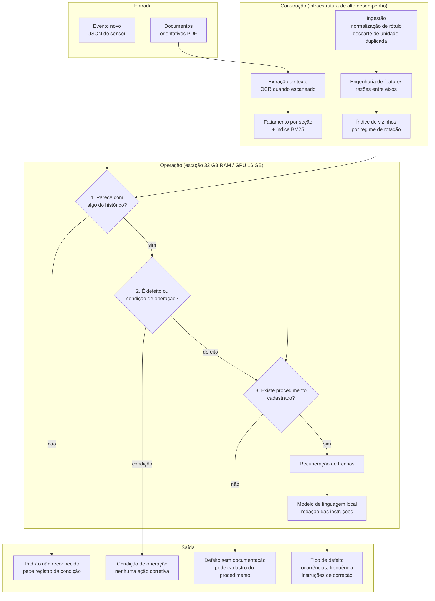
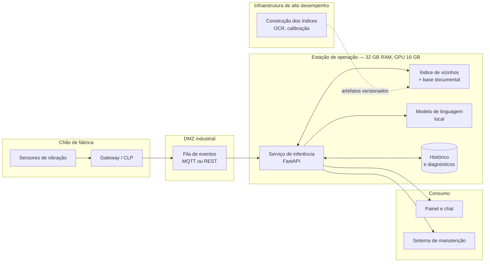

# Arquitetura da Solução

## 1. O problema, reformulado

O enunciado pede manutenção prescritiva com uma restrição que define todo o
desenho: a solução **não deve depender da classificação prévia de falhas
conhecidas**. Deve identificar padrões semelhantes dentro do histórico e
recuperar o conhecimento que ensina a corrigir.

Isso descarta a solução óbvia. Um classificador supervisionado treinado com
`fault` como alvo aprende um conjunto fechado de classes e, diante de um defeito
novo, devolve com confiança a classe conhecida menos errada. É exatamente o
comportamento que o enunciado proíbe.

O desenho adotado inverte a ordem: **o histórico é o modelo**. Um evento novo é
comparado ao passado, os vizinhos encontrados trazem seus próprios rótulos, e o
diagnóstico é o consenso deles. Um defeito nunca visto não tem vizinho próximo,
aparece como distância alta e é recusado em vez de rotulado.

## 2. Visão geral



Os três portões são sequenciais e cada um encerra o diagnóstico. O modelo de
linguagem só é acionado depois que os três passaram, e mesmo ali ele **não
decide o defeito**: recebe o defeito já determinado e o texto do procedimento, e
sua única tarefa é redigir.

## 3. Decisões e o porquê

### 3.1 Similaridade em vez de classificação

`sklearn.neighbors.NearestNeighbors` sobre features padronizadas com
`RobustScaler`. Nenhum rótulo entra como alvo de treino. O rótulo dos vizinhos é
lido no momento da consulta, o que dá três propriedades que um classificador não
tem:

- **rastreabilidade** — cada diagnóstico vem com os eventos históricos que o
  sustentam, com id e data. O técnico pode auditar;
- **atualização sem retreino** — indexar um evento novo é acrescentar uma linha;
- **conjunto aberto** — um padrão sem vizinho próximo é recusado.

### 3.2 Partição por regime de rotação

A vibração escala com a rotação. Comparar um evento de 500 rpm com o histórico
de 2000 rpm não diz nada. Existe um índice por regime, e a busca só encontra
vizinhos comparáveis.

O ensaio operou em quatro rotações fixas — 0, 500, 1000 e 2000 rpm, verificado
em `scripts/eda.py` —, então o pareamento é exato. Uma rotação fora da lista cai
no valor conhecido mais próximo, para o sistema não quebrar em campo.

### 3.3 Descarte de colunas redundantes

Cinco pares de colunas medem a mesma grandeza em unidades diferentes
(polegada/milímetro, Fahrenheit/Celsius). A correlação medida é 1,000000 e o
fator é 25,4. Manter os dois lados dá peso duplo à mesma medida na distância. As
colunas imperiais são descartadas e o Sistema Internacional fica como canônico.

### 3.4 Rejeição calibrada

O limiar de rejeição é o percentil 99 da distância média entre um evento e seus
vizinhos, medido dentro do próprio histórico, separadamente por regime. Um
evento mais distante do histórico do que 99% dos eventos históricos estão entre
si não se parece com nada já visto.

Um segundo portão exige consenso mínimo entre os vizinhos: se o rótulo mais
votado não reúne pelo menos 45% do peso, os vizinhos estão divididos e o
diagnóstico também é recusado.

### 3.5 Cobertura documental decidida pelo escopo, não pelo corpo

O enunciado exige que a solução se detenha aos problemas que possuem documentos.
A associação defeito → documento **não está escrita no código**: é descoberta em
tempo de execução comparando o defeito com o **escopo** de cada documento —
título e objetivo —, nunca com o corpo inteiro.

A distinção não é cosmética. O procedimento de rolamentos lista "Ventiladores"
entre os equipamentos onde rolamentos são críticos. Se a cobertura fosse decidida
por presença do termo no corpo, uma falha de ventoinha receberia o procedimento
de rolamento, e o técnico seria mandado trocar um mancal por causa de uma palavra
numa lista.

A regra tem duas partes: o **termo-chave** é exigência — todos os seus radicais
precisam estar no escopo, senão o documento nem disputa — e os **termos de
contexto** desempatam entre procedimentos que citam o mesmo componente.

Como a descoberta é dinâmica, um documento novo enviado pelo usuário passa a dar
cobertura sem alteração de código. É o outro lado da recusa: quando o sistema diz
"não há procedimento para este defeito", o caminho para resolver é cadastrar o
documento, e o efeito é imediato.

### 3.6 Radical por plural mais truncamento

A busca casa radicais, não palavras. São dois passos porque um só não resolve: o
truncamento sozinho separaria "polia" de "polias" (5 e 6 letras) e o documento de
polias deixaria de cobrir a falha de polia; a regra de plural sozinha não uniria
"desalinhado" com "desalinhamento", que é derivação.

O corte em 6 caracteres é o que separa "correia" de "correcao" — as duas só
divergem na sexta letra, e cortar antes faria a falha de correia casar com os
seis procedimentos, já que todos têm "Correção" no título.

A normalização remove acento dos dois lados da busca. O procedimento de
rolamentos chega por OCR e perde acentuação; sem isso, "correcao" não encontraria
"correção".

### 3.7 Modelo de linguagem local e plugável

O motor de diagnóstico não conhece nenhum modelo: conhece uma interface. Há dois
adaptadores.

O **Ollama** roda um modelo local. Local por exigência do enunciado — a
inferência precisa caber numa estação comercial — e porque o dado de chão de
fábrica não sai da planta.

O **gerador determinístico** monta a resposta recortando os trechos recuperados,
sem modelo. Existe por dois motivos. Operacional: se o serviço do modelo cair, a
planta continua recebendo instrução correta. Técnico: é a linha de base contra a
qual o modelo precisa provar que vale a pena, e como só reproduz texto já
aprovado pela engenharia, **não tem como alucinar**.

A seleção é automática: se o Ollama não responder, o determinístico assume.

### 3.8 Contenção de alucinação

Quatro camadas, da mais forte para a mais fraca:

1. **O modelo não diagnostica.** O tipo de defeito vem da similaridade, que é
   determinística e auditável. O modelo recebe o defeito pronto.
2. **O modelo não fala sem documento.** Se não há procedimento cadastrado, o
   fluxo termina antes de chegar nele.
3. **O contexto é restrito ao documento que cobre aquele defeito**, não à base
   inteira.
4. **A instrução proíbe** acrescentar etapa, ferramenta, tolerância ou valor que
   não esteja no texto, e manda declarar a lacuna quando ela existir.

Toda resposta vem com os trechos que a originaram, para conferência.

## 4. Implantação em ambiente industrial



**Separação entre construção e operação.** O enunciado permite treinar em
infraestrutura de alto desempenho e exige que a operação caiba numa estação
comercial. A separação é literal: OCR, fatiamento, construção do índice e
calibração dos limiares rodam offline e produzem artefatos versionados
(`indice_similaridade.joblib`, `base_conhecimento.json`). A estação apenas
carrega. Nenhum treino acontece em produção.

**Orçamento da estação.** O índice de 144 mil eventos ocupa poucas centenas de
MB; a base documental, alguns MB. O modelo de linguagem é o item dominante, e um
modelo de 7B a 14B em quantização de 4 bits ocupa 5–9 GB de VRAM, dentro dos
16 GB. Os 32 GB de RAM comportam índice, serviço e sistema com folga.

**Por que roda dentro da planta.** Sigilo industrial e conformidade — o dado de
processo não sai; latência — o diagnóstico responde junto do evento; e
disponibilidade — a planta continua operando com o link externo caído.

**Ciclo de vida.** Novos eventos rotulados alimentam a reconstrução periódica do
índice. Novos procedimentos entram pelo próprio painel.

**Monitoramento de deriva.** A taxa de rejeição é o alarme. Ela é uma medida
direta de quanto os eventos que chegam se parecem com o histórico; quando sobe de
forma sustentada, ou a máquina mudou de condição ou a instrumentação foi
recalibrada, e o índice precisa ser reconstruído. A avaliação por campanha
(seção correspondente do README) mostra esse fenômeno acontecendo dentro do
próprio conjunto de dados fornecido, o que torna esse monitoramento uma
necessidade demonstrada, não uma precaução teórica.

## 5. Organização do código

```
src/prescritiva/
├── config.py            configuração e catálogo
├── text.py              normalização, radical, tokenização
├── data/
│   ├── schema.py        contrato do evento, pares de unidade duplicada
│   └── ingest.py        CSV → parquet + SQLite, normalização de rótulo
├── features/build.py    matriz de features, usada na indexação e na consulta
├── similarity/index.py  índice de vizinhos, consenso, rejeição
├── knowledge/
│   ├── extract.py       PDF → texto, OCR com cache
│   ├── chunk.py         fatiamento por seção
│   └── store.py         busca de trecho e regra de cobertura
├── llm/                 interface, adaptador Ollama, gerador determinístico
├── diagnosis/
│   ├── historico.py     estatísticas de ocorrência via SQL
│   └── engine.py        orquestração dos três portões
└── api/main.py          endpoints HTTP
```

`features/build.py` é a peça que amarra o sistema: a mesma função constrói as
features das 144 mil linhas na indexação e as do evento único na consulta. Não
existe caminho separado onde as duas possam divergir.
